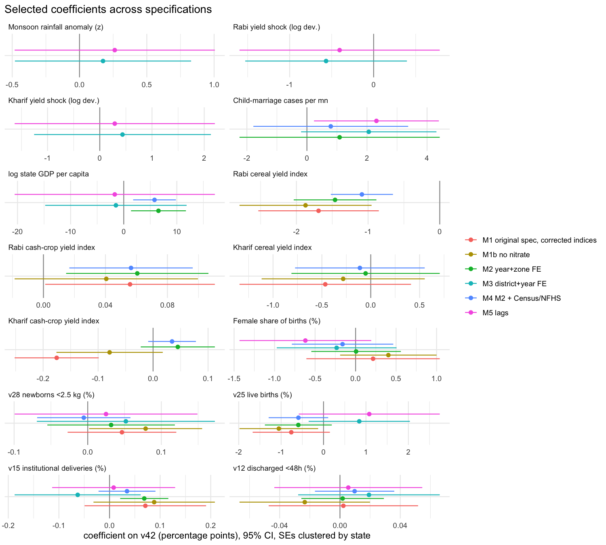
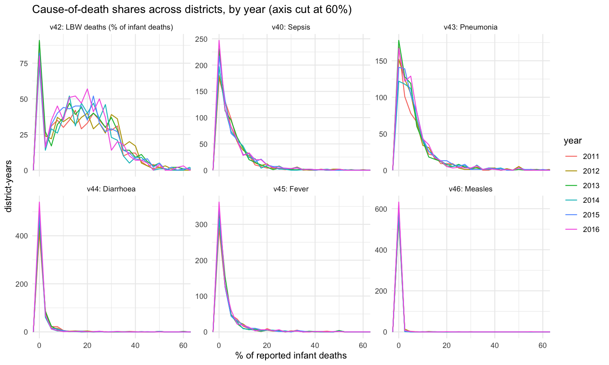

# Agriculture and infant health across Indian districts, 2011–2016

An econometric analysis of the share of reported infant deaths attributed to low birth weight (LBW) across
673 Indian districts and six years, against health-system indicators, crop yields, state economic variables and,
in this revision, Census 2011, NFHS-4 and IMD rainfall data. The project started as coursework (Econometrics,
IIIT-Delhi, 2023; five authors listed below). This revision re-examines the original analysis, corrects the
construction of its key variables, rebuilds the dataset as a reproducible pipeline (Python for data preparation,
R for estimation) and reports the results with fixed effects and clustered standard errors. The original scripts
are preserved under `legacy/`; what was wrong with them and what changed is in [docs/REVIEW.md](docs/REVIEW.md).

Contents: [Data](#data) · [Method](#method) · [Results](#results) · [Robustness](#robustness) ·
[What changed relative to the original analysis](#what-changed-relative-to-the-original-analysis) ·
[Limitations](#limitations) · [How to run](#how-to-run) · [Repository layout](#repository-layout) ·
[Authors and license](#authors-and-license)

## Data

**Source file.** `data/raw/main_final.csv` (41,773 rows) was supplied for the course: for each district, year
(2011–2016), season (Kharif, Rabi, Summer, Whole Year) and crop category (Cereal, Coarse Cereal, Pulse, Oilseed,
Cash, Horticulture) it gives area, production and a yield index (tonnes per hectare for the category), joined to
48 annual district health indicators (`v1`–`v48`, HMIS-style). Only 13 of the 48 are documented in the course
material; the rest are carried unchanged. The original authors added five variables by hand:

| Variable | Level | Source (as documented by the original authors) |
|---|---|---|
| `gdp` | state × year | State GDP, lakh rupees, current prices |
| `beds` | state | Hospital beds, single year |
| `tap` | district | Households with tap water, % |
| `child_marriage` | state × year | Reported cases under the Prohibition of Child Marriage Act, [data.gov.in](https://data.gov.in/resource/stateut-wise-number-child-marriage-cases-prohibition-child-marriage-act-2006-2013-2017) |
| `nitrate` | state × year | Nitrate in surface water, [CPCB](https://cpcb.nic.in/nwmp-data-2019/); missing for 9 states |

**Added in this revision** (files and checksums in [data/external/SOURCES.md](data/external/SOURCES.md)):

| Data | Level | Used for |
|---|---|---|
| Local Government Directory district codes | district | Join spine: LGD code → Census 2011 district code |
| Census 2011 Primary Census Abstract | district, state | Population (per-capita GDP, beds, child-marriage rates), literacy, SC/ST share, agricultural-worker share, urban share |
| NFHS-4 (2015–16) district fact sheets | district | Women's literacy, marriage before 18, antenatal care, iron-folic acid, institutional births, low BMI, anaemia |
| IMD sub-division monthly rainfall 1901–2017 | state × year | Monsoon (June–September) rainfall and its anomaly vs 1981–2010; instrument for yield shocks |

**Processed panel.** `src/prep/` collapses the crop rows to one row per district-year (3,585 rows, 222 columns,
`data/processed/panel.csv`) with per-season, per-category yield indices, within-district yield shocks, lags and
growth rates, cropping structure, zone, per-capita state variables and the external data. Every column is
described in [data/processed/codebook.md](data/processed/codebook.md); join coverage is in
[outputs/tables/join_report.md](outputs/tables/join_report.md) (594 of 673 districts exist in Census 2011; the 79
created later carry NA for Census/NFHS fields).

## Method

Outcome: `v42`, the percentage of reported infant deaths attributed to low birth weight, per district-year.
The sample drops district-years with `v42` above mean + 3 sd (the original rule; alternatives in the robustness
section). Standard errors are clustered by state throughout because GDP, beds, child marriage, nitrate and
rainfall vary only at the state or state-year level.

| Model | Specification |
|---|---|
| M1 | The original regressors (v12, v15, v16, v25, v28, female share of births, log GDP, log beds, log tap, child marriage, nitrate) with crop indices rebuilt per season and category: index when the category is grown, 0 otherwise, plus a grown/not-grown dummy. Pooled OLS, nitrate sample (24 states). |
| M1b | M1 without nitrate: full sample (31 states with tap data). |
| M2 | Reduced set chosen on VIF evidence (v16 dropped, r = 0.94 with v15; GDP per capita and beds per 100,000 instead of state totals; child-marriage cases per million) + year and zone fixed effects. |
| M3 | District and year fixed effects: only time-varying regressors remain (v-variables, GDP per capita, child-marriage rate, season-level yield shocks, monsoon anomaly). |
| M4 | M2 plus Census 2011 and NFHS-4 district controls (districts that exist in Census 2011). |
| M5 | M3 plus one-year lags of the yield shocks and of the monsoon anomaly (harvest in *t−1* → pregnancies → deaths in *t*). |

Yield shock = log yield index minus the district's own 2011–2016 mean, area-weighted across categories within
the season. Details: `R/00_setup.R` (specifications) and `R/03_main_models.R`.

## Results

<!-- BEGIN TABLE: outputs/tables/main_models.md -->
|  | M1 original spec, corrected indices | M1b no nitrate | M2 year+zone FE | M3 district+year FE | M4 M2 + Census/NFHS | M5 lags |
|---|---|---|---|---|---|---|
| v12 discharged <48h (%) | 0.002 | -0.023 | 0.002 | 0.019 | 0.010 | 0.006 |
|  | (0.025) | (0.022) | (0.014) | (0.024) | (0.013) | (0.025) |
| v15 institutional deliveries (%) | 0.071 | 0.088 | 0.069** | -0.063 | 0.035 | 0.008 |
|  | (0.061) | (0.061) | (0.024) | (0.064) | (0.029) | (0.062) |
| v16 safe deliveries (%) | -0.062 | -0.064 |  |  |  |  |
|  | (0.081) | (0.057) |  |  |  |  |
| v25 live births (%) | -0.761 | -1.055* | -0.595 | 0.842 | -0.593 | 1.077 |
|  | (0.464) | (0.473) | (0.402) | (0.609) | (0.358) | (0.848) |
| v28 newborns <2.5 kg (%) | 0.047 | 0.079 | 0.032 | 0.052 | -0.005 | 0.025 |
|  | (0.038) | (0.039) | (0.044) | (0.062) | (0.032) | (0.063) |
| Female share of births (%) | 0.216 | 0.405 | 0.006 | -0.234 | -0.161 | -0.620 |
|  | (0.420) | (0.304) | (0.282) | (0.377) | (0.319) | (0.415) |
| log state GDP | 7.300*** | 6.762*** |  |  |  |  |
|  | (1.815) | (1.835) |  |  |  |  |
| log state beds | -2.771 | -3.976* |  |  |  |  |
|  | (1.789) | (1.766) |  |  |  |  |
| log tap-water HH (%) | 0.441 | 0.922** | 0.246 |  | 0.058 |  |
|  | (0.293) | (0.322) | (0.260) |  | (0.277) |  |
| Child-marriage cases (state count) | -0.014 | -0.024 |  |  |  |  |
|  | (0.065) | (0.057) |  |  |  |  |
| Nitrate (state) | 0.132 |  |  |  |  |  |
|  | (0.120) |  |  |  |  |  |
| log state GDP per capita |  |  | 6.541* | -1.473 | 5.801** | -1.692 |
|  |  |  | (2.638) | (6.792) | (2.054) | (9.620) |
| State beds per 100k |  |  | -0.013 |  | -0.009 |  |
|  |  |  | (0.013) |  | (0.009) |  |
| Child-marriage cases per mn |  |  | 1.088 | 2.059 | 0.794 | 2.314* |
|  |  |  | (1.701) | (1.150) | (1.315) | (1.061) |
| Kharif cash-crop yield index | -0.175*** | -0.079 | 0.045 |  | 0.035 |  |
|  | (0.039) | (0.049) | (0.034) |  | (0.022) |  |
| Grows kharif cash crops (1/0) | 1.333 | 2.044* | 1.243 |  | 0.762 |  |
|  | (1.049) | (0.906) | (0.744) |  | (0.630) |  |
| Kharif cereal yield index | -0.466 | -0.282 | -0.053 |  | -0.111 |  |
|  | (0.448) | (0.426) | (0.387) |  | (0.338) |  |
| Grows kharif cereals (1/0) | 1.467 | 1.137 | 1.256 |  | 0.223 |  |
|  | (1.421) | (1.458) | (1.381) |  | (1.081) |  |
| Rabi cash-crop yield index | 0.056 | 0.041 | 0.061* |  | 0.057** |  |
|  | (0.028) | (0.030) | (0.023) |  | (0.020) |  |
| Grows rabi cash crops (1/0) | -0.467 | 1.607 | 0.932 |  | 0.071 |  |
|  | (0.947) | (1.408) | (0.846) |  | (0.705) |  |
| Rabi cereal yield index | -1.691*** | -1.873*** | -1.461*** |  | -1.086*** |  |
|  | (0.429) | (0.470) | (0.294) |  | (0.221) |  |
| Grows rabi cereals (1/0) | 9.592*** | 8.362*** | 6.939*** |  | 5.280* |  |
|  | (1.759) | (1.355) | (1.676) |  | (2.037) |  |
| Kharif yield shock (log dev.) |  |  |  | 0.435 |  | 0.287 |
|  |  |  |  | (0.864) |  | (0.978) |
| Kharif yield shock, t-1 |  |  |  |  |  | 1.128 |
|  |  |  |  |  |  | (0.748) |
| Rabi yield shock (log dev.) |  |  |  | -0.567 |  | -0.405 |
|  |  |  |  | (0.491) |  | (0.608) |
| Rabi yield shock, t-1 |  |  |  |  |  | -1.102 |
|  |  |  |  |  |  | (0.794) |
| Monsoon rainfall anomaly (z) |  |  |  | 0.175 |  | 0.262 |
|  |  |  |  | (0.334) |  | (0.380) |
| Monsoon anomaly, t-1 (z) |  |  |  |  |  | 0.649* |
|  |  |  |  |  |  | (0.304) |
| Literacy rate 2011 (%) |  |  |  |  | 0.072 |  |
|  |  |  |  |  | (0.046) |  |
| Urban share 2011 (%) |  |  |  |  | 0.010 |  |
|  |  |  |  |  | (0.027) |  |
| SC+ST share 2011 (%) |  |  |  |  | -0.044 |  |
|  |  |  |  |  | (0.021) |  |
| Agricultural workers 2011 (%) |  |  |  |  | 0.053 |  |
|  |  |  |  |  | (0.034) |  |
| NFHS-4 women anaemic (%) |  |  |  |  | 0.002 |  |
|  |  |  |  |  | (0.025) |  |
| NFHS-4 married <18 (%) |  |  |  |  | 0.023 |  |
|  |  |  |  |  | (0.038) |  |
| NFHS-4 4+ ANC visits (%) |  |  |  |  | 0.093*** |  |
|  |  |  |  |  | (0.016) |  |
| NFHS-4 women BMI<18.5 (%) |  |  |  |  | 0.252*** |  |
|  |  |  |  |  | (0.062) |  |
| N | 2375 | 3478 | 3478 | 3432 | 3143 | 2664 |
| R2 within |  |  | 0.083 | 0.008 | 0.121 | 0.013 |
| Adj. R2 | 0.253 | 0.216 | 0.267 | 0.453 | 0.288 | 0.484 |
| R2 | 0.259 | 0.220 | 0.272 | 0.557 | 0.296 | 0.605 |

Standard errors in parentheses. * p < 0.05, ** p < 0.01, *** p < 0.001.
Sample: district-years with v42 below mean + 3 sd. Crop indices are tonnes/ha for the category when grown, 0 otherwise, with a grown dummy.
M3 and M5 absorb every time-invariant district and state variable (beds, tap, nitrate, Census, NFHS).
<!-- END TABLE -->

<!-- BEGIN TABLE: outputs/tables/main_models_fit.md -->
| model | N | states | districts | adj_r2 | within_r2 |
|---|---|---|---|---|---|
| M1 original spec, corrected indices | 2375 | 24 | 565 | 0.2533 |  |
| M1b no nitrate | 3478 | 31 | 659 | 0.2157 |  |
| M2 year+zone FE | 3478 | 31 | 659 | 0.2667 | 0.08308 |
| M3 district+year FE | 3432 | 33 | 635 | 0.453 | 0.007824 |
| M4 M2 + Census/NFHS | 3143 | 31 | 584 | 0.2881 | 0.1209 |
| M5 lags | 2664 | 33 | 612 | 0.4837 | 0.01291 |
<!-- END TABLE -->



What the table shows:

- **Between districts, two associations are stable across M1–M4 and survive a district cluster bootstrap:**
  a higher state GDP per capita goes with a higher LBW share of infant deaths (M2: +6.5 percentage points per
  log point, bootstrap 95% CI 4.0 to 9.0), and a higher rabi cereal yield index goes with a lower share
  (M2: −1.5 points per tonne/ha, CI −1.9 to −1.0), with a positive offset for districts that grow rabi cereals
  at all. The GDP sign is the opposite of a nutrition story; the most plausible reading is that richer states
  attribute a larger share of infant deaths to LBW (cause-of-death reporting), not that they have more of them.
- **Within districts, nothing explains changes in `v42` over time.** With district and year fixed effects
  (M3, M5) the within-R² is below 0.02 and no contemporaneous yield shock, rainfall anomaly or health-process
  variable is distinguishable from zero; the one exception is the one-year-lagged monsoon anomaly in M5 (+0.65,
  p = 0.04), a single marginal coefficient among the many tested. Child-marriage cases per million is the only within-district coefficient whose
  bootstrap interval excludes zero (M3: +2.1, CI 0.1 to 4.6), and it is a state-level reported count.
- **Health-process variables.** Institutional deliveries (v15) keep the positive sign the original report found,
  but only in the year+zone model (M2: +0.07 per point, p < 0.01); it is absent with district effects. v12,
  v25, v28 and the female share of births are not distinguishable from zero in any specification once standard
  errors are clustered.
- **District controls (M4).** Districts where more women have BMI below 18.5 (+0.25 per point) and where
  antenatal-care coverage is higher (+0.09 per point) report a higher LBW share; literacy, urbanisation and
  SC/ST share add nothing.

Other causes of death (sepsis, pneumonia, diarrhoea, fever, measles) under the same specifications:
[outputs/tables/other_outcomes_m2.md](outputs/tables/other_outcomes_m2.md),
[outputs/tables/other_outcomes_m3.md](outputs/tables/other_outcomes_m3.md). Descriptive statistics:
[outputs/tables/descriptives.md](outputs/tables/descriptives.md); figures in `outputs/figures/`.



## Robustness

| Check | Result | Table |
|---|---|---|
| Standard-error treatment for M1 | iid vs HC1 vs state-clustered: clustering multiplies the SEs on the state-level regressors by 2 to 3; child marriage, beds, tap and nitrate lose significance | [m1_se_comparison.md](outputs/tables/m1_se_comparison.md) |
| Trimming rule | mean+3sd (original), none, 1st–99th percentile: the rabi-cereal and rabi-cash terms keep sign and significance under all three; with no trimming the M2 coefficients on v15 and GDP per capita lose significance (the 38 district-years above 60% pull them); no significant coefficient changes sign | [robustness_trimming.md](outputs/tables/robustness_trimming.md) |
| Fractional logit (M2, outcome/100) | Average marginal effects match the OLS coefficients in sign and size | [robustness_fractional_logit.md](outputs/tables/robustness_fractional_logit.md) |
| District cluster bootstrap, 999 draws | Percentile CIs for M2 and M3; replaces the legacy Monte Carlo subsampling | [robustness_bootstrap.md](outputs/tables/robustness_bootstrap.md) |
| Structural break at 2014 | Joint Wald test on post-2014 interactions rejects stability (F = 50); the GDP-per-capita and grows-rabi-cereal coefficients are both smaller after 2014 | [robustness_break2014.md](outputs/tables/robustness_break2014.md) |
| Rainfall as instrument for the kharif yield shock | First-stage F = 13.5 unclustered but 2.3 with state clustering: weak; 2SLS not interpreted | [robustness_iv.md](outputs/tables/robustness_iv.md) |
| Clustering by district instead of state | District clustering gives smaller SEs on the state-level regressors (GDP per capita, beds gain stars); the state-clustered SEs reported above are the conservative ones | [robustness_clustering.md](outputs/tables/robustness_clustering.md) |
| Multicollinearity (VIF, M1) | v15/v16 and log GDP/log beds above 10 | [vif_m1.md](outputs/tables/vif_m1.md) |

## What changed relative to the original analysis

`R/02_replicate_original.R` reproduces both README tables of the original project to six decimals
([replication_kharif.md](outputs/tables/replication_kharif.md),
[replication_rabi.md](outputs/tables/replication_rabi.md)) and records that the Kharif table was produced with
`log(tap)` although the committed script uses `tap` in levels. The full review is in
[docs/REVIEW.md](docs/REVIEW.md); the points that change the conclusions:

1. The original `cash_index`/`cereal_index` were the yield of whichever crop row came first in the file for each
   district-year, with the other set to zero. Rebuilt per category, the Kharif cash-crop effect (−0.20, p < 1e-16
   originally) is −0.08 and not significant in the full sample.
2. The Kharif and Rabi tables were the same outcome and regressors with a different first row; they are one
   model now, with both seasons' indices.
3. iid standard errors on state-level regressors with 24 states overstated precision; clustered, the
   child-marriage (−0.08***) and hospital-bed (−3.9***) effects are indistinguishable from zero.
4. Listwise deletion on nitrate had removed nine states; nitrate is never significant and is dropped after M1.
5. The panel structure is used: district fixed effects remove all cross-district associations.
6. The narrative "drop in child-marriage cases in 2014" is not in the data: the state totals are 214, 304, 240,
   277, 298, 321 for 2011–2016.

## Limitations

- `v42` is a share of *reported* infant deaths by *reported* cause; reporting completeness differs by state and
  year and is the most likely driver of the GDP association. No death counts are available to weight by.
- 35 of the 48 health indicators are undocumented; only the documented ones are used.
- GDP, beds, child marriage, nitrate and rainfall are state-level; district variation in those is unobserved.
  Beds and tap water are single-year values.
- Census and NFHS controls are time-invariant and come from 2011 and 2015–16 respectively; 79 districts created
  after 2011 have no values.
- Rainfall is averaged from IMD sub-divisions to states; district rainfall was not attempted.
- Six years is a short panel; within-district estimates have wide intervals.

## How to run

Requirements: R ≥ 4.3, Python ≥ 3.10, GNU make. On macOS:

```bash
brew install r
```

```bash
Rscript R/install_packages.R
```

```bash
python3 -m venv .venv && .venv/bin/pip install -r requirements.txt
```

Rebuild everything (data preparation, all models, tables, figures, README tables):

```bash
make all
```

`make data` runs only the Python steps (`src/prep/01_clean_raw.py` … `04_build_panel.py`), `make analysis`
only the R scripts; `make clean` removes the git-ignored intermediates; `make distclean` also removes the committed generated files
(panel, codebook, tables, figures), which `make all` recreates. Individual scripts run from the repository root, e.g.
`Rscript R/03_main_models.R`. The pipeline is deterministic (fixed seeds); a second run produces no diff.
Legacy scripts: `Rscript legacy/Code/Regression/q1a.r` (see [legacy/NOTES.md](legacy/NOTES.md)).

## Repository layout

```
data/raw/            source file and the five hand-collected variables (unchanged)
data/external/       Census 2011, NFHS-4, LGD codes, IMD rainfall, sub-division→state map, SOURCES.md
data/processed/      generated by `make data`; only panel.csv and codebook.md are committed
src/prep/            Python data preparation (four numbered steps + common.py)
R/                   00_setup (paths, specs, helpers) · 01_descriptives · 02_replicate_original ·
                     03_main_models · 04_robustness · 05_other_outcomes · 06_figures · 07_render_readme
outputs/tables/      generated markdown/csv tables     outputs/figures/   generated PNGs
docs/REVIEW.md       review of the original analysis
legacy/              original scripts (path fixes only), original README, screenshots, NOTES.md
Reports/             the two course reports (PDF)
```

## Authors and license

Utkarsh Arora, Keshav Rajput, Krishnasai Addala, Samarth Raina, Sejal Kardam (original project, 2023).
Revision (2026): Keshav Rajput.

Code and generated data are released under the GNU General Public License v3.0 or later ([LICENSE](LICENSE)).
External data files keep their sources' terms (see `data/external/SOURCES.md`); the course dataset was provided
for the course and is redistributed here as received.

References used by the original report: [nitrate and maternal health](https://www.ncbi.nlm.nih.gov/pmc/articles/PMC1392223/);
[child marriage and low birth weight](https://onlinelibrary.wiley.com/doi/full/10.1002/ajhb.23709);
[sex ratio and low birth weight](https://pubmed.ncbi.nlm.nih.gov/25096219/);
[maternal health and low birth weight](https://journals.plos.org/plosone/article?id=10.1371/journal.pone.0244562).
